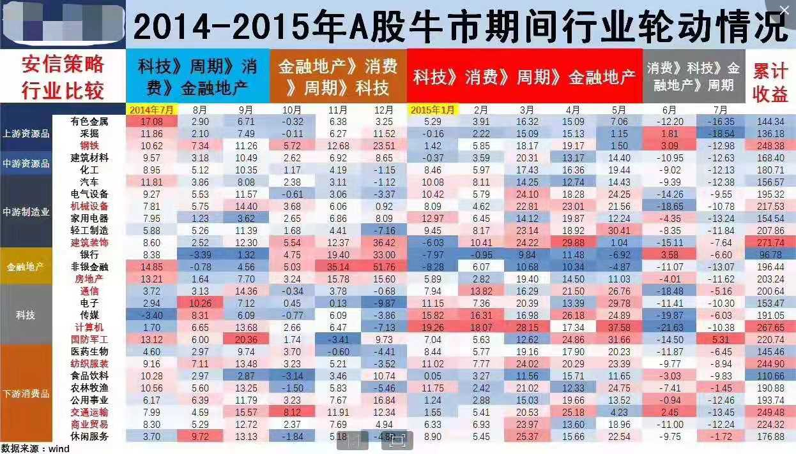
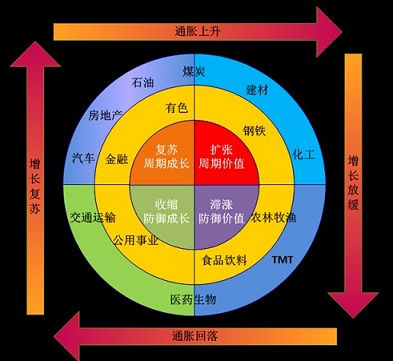

# 行业轮动

## 行业分类

行业分类方法有很多，如我们可以将行业分为以下几类：

周期性：当增长加速时，股票和大宗商品表现好，周期性行业例如汽车、房地产、钢铁股战胜市场；当增长放缓，债券、现金和防守型股票战胜市场。

成长性：当通胀率下降，贴现率下降，金融资产表现好，成长型股票战胜市场；当通胀率上升，大宗商品等实物资产和现金表现最好，定价权变强，价值型股票战胜市场。

利率敏感性：银行和消费类股票是利率敏感型的“早周期”表现者，在衰退和复苏阶段，当中央银行放松政策和经济增长率开始回升时表现最好。

资产类品种：一些行业和其拥有的资产的表现紧密相关，银行保险经常对债券和股票价格敏感，在衰退和复苏阶段表现好；采矿业股票对金属价格敏感，在过热阶段表现好；石油和天然气行业对油价敏感，在滞胀阶段战胜市场。

在华泰证券的研报中，股票基金被划分为周期、成长、消费、金融、稳定等等风格。

行业分析可以从以下角度进行分析：

* 政策：宏观政策、产业政策
* 产业链和价值链：行业的上下游，在产业链上谁的话语权更强
* 技术：技术变化，过去、现在和未来的技术
* 市场相关：市场集中度、市场份额、国内外市场，进入壁垒和退出情况
* 具体分析：分析优势公司和较差公司

## 经济解释

### 经济周期

行业轮动现象：

行业轮动的本质是经济周期的轮动，不同行业对于经济周期的反应不同，不同行业还受到政策的影响。行业可分为周期行业和非周期行业。

周期循环通常是沿着产业链按一定的顺序地依次发生：住房和汽车消费是引领经济景气周期启动的主要和先导动力，这些行业在经济上升阶段(复苏期)的良好表现，将逐步带动机械设备、化工、建材等中游制造业的兴起，并传导到有色、钢铁、煤炭、石油等上游资源品行业，此时经济到达过热期。衰退也是由下游行业开始，逐步传导到上游行业。在经济景气的最高峰，商业一片繁荣，此时的主角就是非必需的消费品，如轿车、高档服装、奢侈品、消费类电子产品和旅游等行业，享受最后的经济周期盛宴。当经济下滑(滞胀期、衰退期)，周期性行业业绩受到影响，而医药、必选消费等非周期性行业由于需求弹性小，受宏观经济影响不大，表现相对较好；银行价格相对较稳定，需求波动也较小，且作为利率敏感型的“早周期”表现者，兴起于衰退后期。当然，考虑到历史背景不同，行业周期轮动并非简单的重复，不能直接套用历史经验判断周期拐点，而应根据经验具体情况具体分析。

| 阶段 | 经济 | 通胀 | 最佳大类资产 | 最佳股票行业       |
| ---- | ---- | ---- | ------------ | ------------------ |
| 收缩 | 下行 | 下行 | 债券         | 公共事业           |
| 复苏 | 上行 | 下行 | 股票         | 金融、有色         |
| 扩张 | 上行 | 上行 | 商品         | 钢铁               |
| 滞涨 | 下行 | 上行 | 现金         | 食品饮料、农林牧渔 |

## 行业轮动策略

### 根据经济宏观情况配置

#### 思想

如将M2作为评价货币供应增速的标准，在货币政策扩张时等权配置周期性行业，紧缩时等权配置非周期性行业。

可以通过统计周期性行业和非周期性行业在货币政策处于扩张或紧缩时期的不同表现进行验证。

### 根据市场情绪配置

市场情绪指标如换手率、MACD指标、VIX等。

一般市场情绪指标过于依赖历史信息，在遭遇行情剧烈波动时会发生误判，所以需要设置止损。

#### 思想

分析市场情绪指标后，评价哪些行业具有绝对优势，哪些行业具有比业绩基准更强的上扬趋势。

策略一：利用市场情绪指标评估行业绝对趋势强度，选择绝对强势行业和相对趋势强度，

策略二：利用市场情绪指标评估业绩基准趋势强度，在此基础上评估行业相对趋势强度