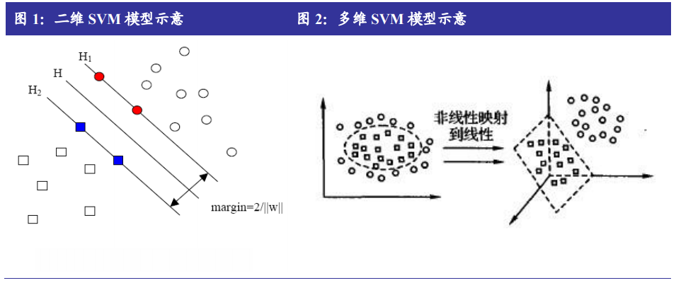
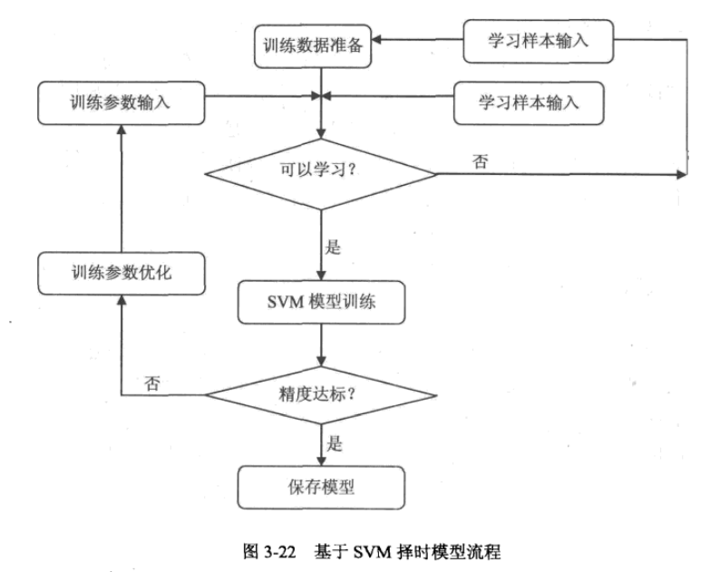
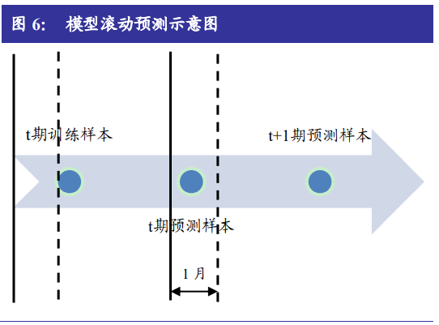
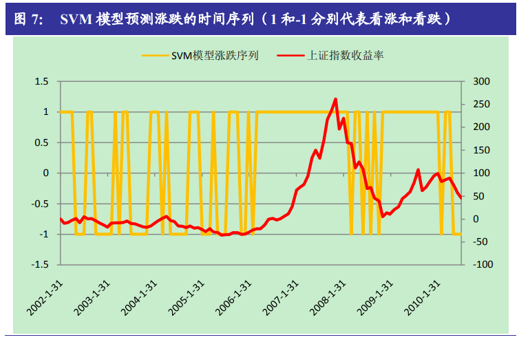
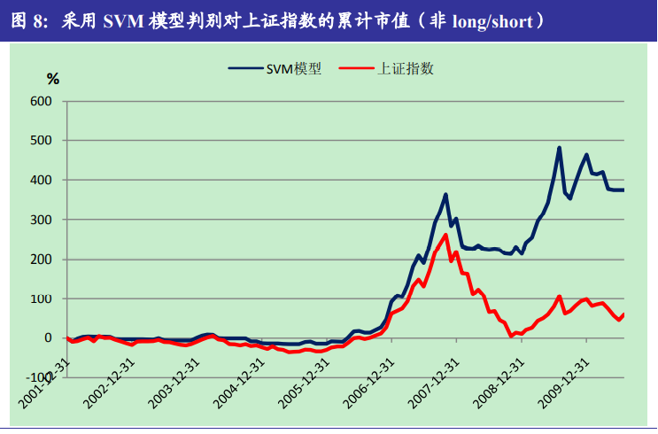
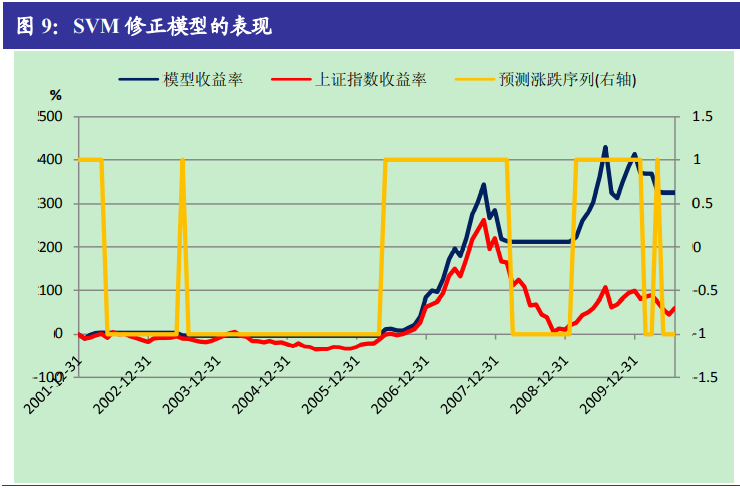

# 3.6 支持向量机

摘要：支持向量机（SVM）是目前很流行的一个数学方法，主要用于分类和预测。择时本质上是一盒预测过程，即用过去的数据预测未来一段时间上大盘是上涨还是下跌。但是市场是非线性的，使得传统的线性预测方法效果不佳。由于SVM独特的机制和效果，对非线性预测有非常好的效果，因此利用SVM技术来建立择时模型，可以有效地避免传统回归模型的精度和扩展性问题。

## 一、SVM简介

### 1、**核心思想**

**核心思想**可以概括为：寻找一个最优分类超平面，使得训练样本中的两类样本点尽量被无错误的分开，并且要使两类的分类间隔最大；而对线性不可分问题，通过核函数将低维输入空间的数据映射到高维空间，从而将原低维空间的线性不可分问题转化为高维空间上的线性可分问题，然后在这个新空间中求取最优分类面。

SVM 方法的**优点**在于：适合有限样本或小样本的问题，因此对于金融时间序列具备可适性；很大程度上解决了传统方法（如神经网络）中存在的问题，如过学习、非线性、多维问题、局部极小点问题等。

**基本思想**可用图1中的二维情况予以说明。 图 1 中方形点和圆形点代表两类样本，H 为分类线，H1、H2 分别为各类中离分类线最近的样本且平行于分类线的直线，它们之间的距离叫做分类间隔（margin）。 所谓最优分类线就是要求分类线不但 能将两类正确分开（训练错误率为 0），而且使分类间隔最大。如果我们把这个逻辑推广到高维空间， 最优分类线就变为最优分类面。对非线性问题，可以通过非线性变换转化为某个高维空间中的线性问题，在变换空间求最优分类面，如图 2 所示。

### 2、模型

设线性可分样本集为 xi , yi  ，i = 1,2, … n，x ∈$R^{\mathrm{d}}$，y ∈ {+1, −1}，则 d 维空间中线性判别函数的一般形式为：$g(x)=w \cdot x+b （1）$

分类面方程为：$\mathrm{w} \cdot \mathrm{x}+\mathrm{b}=0 （2）$

将判别函数进行归一化，使两类所有样本都满足 |g(x)|≥1，即使离分类面最近的样本的|g(x)|=1， 这样分类间隔就等于 2/‖w‖，因此间隔最大等价于使‖w‖（或‖w‖2）最小；而要求分类线对所 有样本正确分类，就是要求其满足：

$$y_{i}\left[\left(w \cdot x_{i}\right)+b\right]-1 \geq 0(i=1,2, \ldots n) （3）$$

能使上式中等号成立的，也就是位于 margin 上的样本，就是支持向量。我们通过构造拉格朗日 函数，求解拉格朗日函数的鞍点，代入拉格朗日函数从而求得原始问题的对偶问题，进而得到 SVM 模型的解。

在**线性不可分**的情况下，可以在条件 yi[(w·xi)+b]-1≥0 中加入一个松弛项{εi }i=1 n ，εi > 0，成为 yi [(w·xi)+b]≥1- ，则分类面的求解问题变为：

$$\min\left(\frac{1}{2}|| \mathrm{w} \|^{2}+\mathrm{C} \sum_{\mathrm{i}=1}^{\mathrm{n}} \varepsilon_{\mathrm{i}}\right)$$

$$y_{i}\left(w \cdot x_{i}-b\right) \geq 1-\varepsilon_{i}(i=1,2, \ldots n) （4）$$

$$\varepsilon_{\mathrm{i}} \geq 0$$

折衷考虑最少错分样本和最大分类间隔，就得到**广义最优分类面**，其中，C>0 是一个常数，它控制对错分样本惩罚的程度。 对非线性问题，可以通过非线性变换转化为某个高维空间中的线性问题，在变换空间求最优分类面。常用到的核函数有线性核函数（linear kernel）、多项式核函数（polynomial kernel），径向基核函数（radical basis function，RBF）、Sigmoid 核函数（Sigmoid tanh），其具体表达式见(5)-(8)选择不同的核函数则可以构造实现输入空间中不同类型的非线性决策面的学习机，从而导致不同的支持向量机算法。

a. 线性核函数(linear kernel) $k\left(x, x_{i}\right)=x \cdot x_{i} （5）$

b. 多项式核函数(polynomial kernel) $k\left(x, x_{i}\right)=\left(s\left(x \cdot x_{i}\right)+c\right)^{d} （6）$

其中 s，c，d 为参数。

c. 径向基核函数（radical basis function）$k\left(x, x_{i}\right)=\exp \left(-\gamma\left(\left|x-x_{i}\right|\right)^{2}\right)+\mathrm{c}（7）$

其中$\gamma\$为参数。

d. Sigmoid 核函数（Sigmoid tanh）$\left.\mathrm{k}\left(\mathrm{x}, \mathrm{x}_{\mathrm{i}}\right)=\tanh\ (\mathrm{s}\left(\mathrm{x} \cdot \mathrm{x}_{\mathrm{i}}\right)+\mathrm{c}\right) （8）$

其中 s，c 为参数。

以上四种核函数中，以径向基核函数（RBF）的应用最为广泛，该核函数在高维，低维，大样本，小样本 等情况均表现出较好的适用性，是理想的核函数。在使用径向基核函数的时候我们要对参数 C 和γ进行选择。**C 用来确定的数据子空间中调节学习机器臵信区间，而核参数γ的改变实际上是隐含地改变 映射函数从而改变样本数据子空间分布的复杂程度，也就决定了线性分类达到最小误差。**

现实生活中的股票市场是一个典型的复杂系统，股市的涨跌受到多种因素的影响，而这些因素间 的相互作用常常是非线性和时变的。因此，很多传统的手段对于股市的预测效果往往不尽人意。如果我们**将股票市场的涨跌作为一个分类变量 y（y ∈ {+1, −1}），而将影响股票市场涨跌的变量，诸如 CPI、 PPI、M1、M2 以及股市收益、成交额等因素作为向量 x（x∈**$R^{\mathrm{d}}$**）**。从而根据向量机方法，我们可以将股市的涨跌问题转换成分类问题。

## 二、SVM用于择时策略过程

**利用SVM技术对股票价格进行预测主要包括训练数据准备、训练参数输入、学习样本输入、模型训练学习、评估训练结果、训练参数优化等一系列循环的过程。**

（1）在数据准备阶段主要是对预测指标的选定和已有历史数据资料的收集，并确定股票价格影响的输入向量。

（2）训练参数输入阶段的任务主要是确定SVM模型的参数${\gamma}$和${\sigma}$（以RBF核函数为例）。如果是初次运行，则可以随意地预定义上述两个参数的值；但如果是重复运行多次，这时训练参数优化的步骤便开始起作用。

（3）学习样本输入阶段的任务是将学习样本进行标准化，处理公式为：$y_{i}=\frac{x_{i}-\overline{x_{i}}}{\sigma}$。其中，$\overline{x_{i}}$为$x_{i}$分量的平均值，${\sigma}$为$x_{i}$分量的标准差。在完成标准化工作后，将样本集**任意**地分为训练样本和测试样本，分别用于模型训练和精度检验。

（4）模型训练阶段包括：对输入的训练样本进行训练，得到模型的初始值a和b；然后利用上述算法提取出有效的、相关的数据点重新训练，得到最终的模型。

（5）训练结果评估阶段是对训练得出的模型推广（或称泛化）能力进行验证。所谓推广能力，是指经训练（学习）后的模型对未在**训练集**中出现的样本（即**测试样本集**）做出正确反应的能力，通常用平均平方误差（MSE）表示。

如果得出MSE结果较小，则说明该评估模型的推广能力强，或泛化能力强，否则就说明其推广能力较差。另外，也可以用平均绝对百分误差（MAPE）来衡量。当然还有很多其他的衡量指标，如误差绝对值的最大值、误差绝对值的平均值等。

将输入变量分为四个大类，分别是市场前期走势、货币环境、经济指标、外围环境等。市场走势中我们又继续选取了前期涨幅（前一月涨幅、前三月累积、前六月累积）、区间波动率等参数，以期反映市场在波动、换手、动量等维度的 信息。类似的方法，我们也选择了经济面和外围环境中一些与 A 股市场关系密切的变量（例如图 3 所示），用这些变量来构筑参数平面。经济数据中由于 CPI、M1 等数据一般都在月中公布，因此我们在预测中使用的是滞后两期的数据。

先进行样本内的参数测算（训练）， 然后再进行样本外的测算，参考国内外相关研究文献后我们将训练样本的长度选为 24 个月。考虑到 股票市场作为一个系统的时变性，我们选用 t-24 到 t-1 月为训练样本来预测第 t 个月指数的涨跌。当 我们要预测第 t+1 个月上证涨跌时则选用 t-23 到 t 月为训练样本，以此类推。

## 三、模型的结果与修正

径向基核函数$k\left(x, x_{i}\right)=\exp \left(-\gamma\left(\left|x-x_{i}\right|\right)^{2}\right)+\mathrm{c}$，采用的参数为 C=10， γ = 0.1，选择的理由是基于我们多次调试的结果以及本身就是默认参数。

数据时间为：2000 年 1 月至 2010 年 7 月

训练时间为 24 个月，这样可以考量正确率的样本外推测期是从 2002 年 1 月至 2010 年 7 月。

在每个月的月初（也就是上个月的月末）判断下个月上证指数的涨跌。

### 1、模型结果

如果考虑单边买卖的成本是 0.5%，并且如果模型看涨则全仓买入，看跌则清仓，这样下来我们 104 个月的收益率为 375%，远远高于同期的指数涨幅（60%），并且到现在的累积收益已经超过了 07 年时的高点。当然，如果我们可以沽空，那么收益率将会更高。

### 3、模型修正

很多技术派的模型具备一些特点，例如非线性动力学方法有时可以提前判断大拐点，而均线法一般适用于强趋势性市场。我们可以将这些模型进行组装和配对，奇妙利用各自的优点。图 9 显示的是我们对原有 SVM 模型进行修正后得到的结果。修正的方法是在原有模型之中加入一个小判 别程序，这个判别程序有利于趋势的维持。从修正后模型的表现来看，交易次数明显减少（104 个月 只出现 9 次单边交易），胜率略有下降（由 64%下降到 62%），累积收益也有所下降（由 375%下降到 325%）。

虽然累积收益有所下降，但这种修正模型给我们提供了一种思想。当然，既能够减少交易次数， 又能提高胜率，还能提高收益的修正是最完美的。**但很多时候，修正就是交易次数、胜率与收益率之 间的一种 trade-off，难以做到完美。**

SVM 模型在 06 年之后的表现要大大好于 06 年之前，06 年之后单月判别的胜率都在 67%以上。可能的原因之一是模型更加适用于趋势性的市场，原因之二或是我国市场的效率正在提高，经济面参 数对股市正在产生较大的影响。**SVM 模型的缺点在于对震荡市和下跌市场的预测能力较差，并且交 易信号较为频繁。**而修正后的 SVM 模型的交易信号能够显著减少。

## 参考文献：

[1]机器学习--支持向量机（六）径向基核函数（RBF）详解

[https://blog.csdn.net/weixin_42398658/article/details/83215916](https://blog.csdn.net/weixin_42398658/article/details/83215916?fileGuid=ryrWyhqGrvVHj6DT)

[2] 国信证券. 机器学习专题研究——SVM 算法选股以及 Adaboost 增强，20160531

[20160531-国信证券-机器学习专题研究：SVM算法选股以及Adaboost增强.pdf](https://uploader.shimo.im/f/bmkhDsxNFO11DggP.pdf?fileGuid=ryrWyhqGrvVHj6DT)

[3] 长城证券. 基于 SVM 的量化择时方法——量化投资系列之六，20100831

[基于 SVM 的量化择时方法――量化投资系列之六.pdf](https://uploader.shimo.im/f/WV2hXrKury6iehvw.pdf?fileGuid=ryrWyhqGrvVHj6DT)

