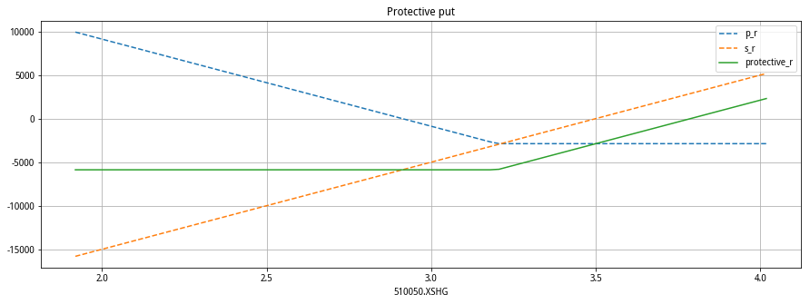
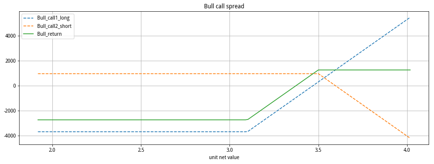
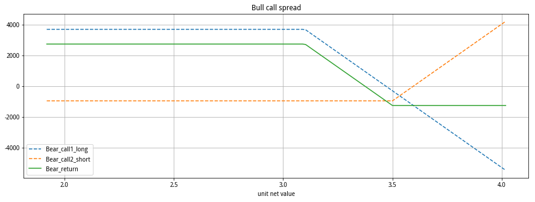
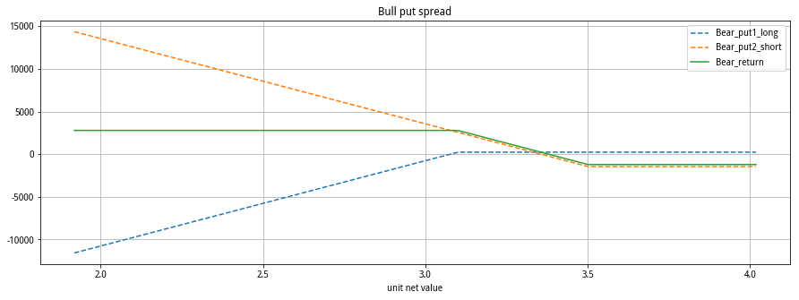
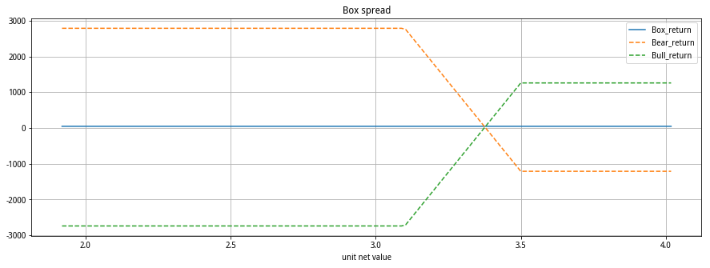

```python
import pandas as pd
import numpy as np
import datetime as dt
import matplotlib.pyplot as plt
from jqdata import *
from pyecharts.charts import *
from pylab import mpl
mpl.rcParams['font.sans-serif']=['SimHei']
mpl.rcParams['axes.unicode_minus']=False
# from pyecharts import options as opts
#pd.set_option('display.max_columns', 500) # 打印最大列数
#pd.set_option('display.max_rows',1000) # 打印最大列数
```

## 1 期权数据读取及处理


```python
# 所有期权合约
df1 = get_all_securities('options',date=None)
```


```python
# 50ETF 期权合约到期日信息
q=query(opt.OPT_EXERCISE_INFO).filter(opt.OPT_EXERCISE_INFO.underlying_symbol=='510050.XSHG').order_by(opt.OPT_EXERCISE_INFO.exercise_date.desc())
df=opt.run_query(q)
```


```python
# 希腊值
q=query(opt.OPT_RISK_INDICATOR).filter(opt.OPT_RISK_INDICATOR.code=='10003325.XSHG').order_by(opt.OPT_RISK_INDICATOR.date.desc())
df=opt.run_query(q)
```


```python
# 50ETF期权合约信息
Option_50 = opt.run_query(query(opt.OPT_CONTRACT_INFO).filter(opt.OPT_CONTRACT_INFO.underlying_symbol=='510050.XSHG'))
```


```python
# 50ETF单位净值现价
Price_50 = get_extras('unit_net_value', ['510050.XSHG'], start_date='2015-12-01', end_date='2021-4-26').sort_values(['510050.XSHG'])
```


```python
# 提取2021-05-26日到期CALL/PUt合约
Option_50.exercise_date = pd.to_datetime(Option_50.exercise_date)
Option_502105 = Option_50[Option_50.exercise_date =='2021-05-26']
Call = Option_502105.groupby('contract_type').get_group('CO').sort_values('exercise_price')
Put = Option_502105.groupby('contract_type').get_group('PO').sort_values('exercise_price')
Call.reset_index(drop=True, inplace=True)
Put.reset_index(drop=True, inplace=True)
```


```python
Call
```


<div>
<style scoped>
    .dataframe tbody tr th:only-of-type {
        vertical-align: middle;
    }

    .dataframe tbody tr th {
        vertical-align: top;
    }

    .dataframe thead th {
        text-align: right;
    }
</style>
<table border="1" class="dataframe">
  <thead>
    <tr style="text-align: right;">
      <th></th>
      <th>id</th>
      <th>code</th>
      <th>trading_code</th>
      <th>name</th>
      <th>contract_type</th>
      <th>exchange_code</th>
      <th>currency_id</th>
      <th>underlying_symbol</th>
      <th>underlying_name</th>
      <th>underlying_exchange</th>
      <th>underlying_type</th>
      <th>exercise_price</th>
      <th>contract_unit</th>
      <th>contract_status</th>
      <th>list_date</th>
      <th>list_reason</th>
      <th>list_price</th>
      <th>high_limit</th>
      <th>low_limit</th>
      <th>expire_date</th>
      <th>last_trade_date</th>
      <th>exercise_date</th>
      <th>delivery_date</th>
      <th>is_adjust</th>
      <th>delist_date</th>
      <th>delist_reason</th>
    </tr>
  </thead>
  <tbody>
    <tr>
      <th>0</th>
      <td>480146</td>
      <td>10003369.XSHG</td>
      <td>510050C2105M03000</td>
      <td>50ETF购5月3000</td>
      <td>CO</td>
      <td>XSHG</td>
      <td>CNY</td>
      <td>510050.XSHG</td>
      <td>50ETF</td>
      <td>XSHG</td>
      <td>ETF</td>
      <td>3.0</td>
      <td>10000</td>
      <td>LIST</td>
      <td>2021-04-16</td>
      <td>价格波动</td>
      <td>0.4194</td>
      <td>0.7613</td>
      <td>0.0775</td>
      <td>2021-05-26</td>
      <td>2021-05-26</td>
      <td>2021-05-26</td>
      <td>2021-05-27</td>
      <td>0</td>
      <td>None</td>
      <td>None</td>
    </tr>
    <tr>
      <th>1</th>
      <td>398756</td>
      <td>10003325.XSHG</td>
      <td>510050C2105M03100</td>
      <td>50ETF购5月3100</td>
      <td>CO</td>
      <td>XSHG</td>
      <td>CNY</td>
      <td>510050.XSHG</td>
      <td>50ETF</td>
      <td>XSHG</td>
      <td>ETF</td>
      <td>3.1</td>
      <td>10000</td>
      <td>LIST</td>
      <td>2021-03-25</td>
      <td>合约到期</td>
      <td>0.3700</td>
      <td>0.7154</td>
      <td>0.0246</td>
      <td>2021-05-26</td>
      <td>2021-05-26</td>
      <td>2021-05-26</td>
      <td>2021-05-27</td>
      <td>0</td>
      <td>None</td>
      <td>None</td>
    </tr>
    <tr>
      <th>2</th>
      <td>398757</td>
      <td>10003326.XSHG</td>
      <td>510050C2105M03200</td>
      <td>50ETF购5月3200</td>
      <td>CO</td>
      <td>XSHG</td>
      <td>CNY</td>
      <td>510050.XSHG</td>
      <td>50ETF</td>
      <td>XSHG</td>
      <td>ETF</td>
      <td>3.2</td>
      <td>10000</td>
      <td>LIST</td>
      <td>2021-03-25</td>
      <td>合约到期</td>
      <td>0.2878</td>
      <td>0.6332</td>
      <td>0.0001</td>
      <td>2021-05-26</td>
      <td>2021-05-26</td>
      <td>2021-05-26</td>
      <td>2021-05-27</td>
      <td>0</td>
      <td>None</td>
      <td>None</td>
    </tr>
    <tr>
      <th>3</th>
      <td>398758</td>
      <td>10003327.XSHG</td>
      <td>510050C2105M03300</td>
      <td>50ETF购5月3300</td>
      <td>CO</td>
      <td>XSHG</td>
      <td>CNY</td>
      <td>510050.XSHG</td>
      <td>50ETF</td>
      <td>XSHG</td>
      <td>ETF</td>
      <td>3.3</td>
      <td>10000</td>
      <td>LIST</td>
      <td>2021-03-25</td>
      <td>合约到期</td>
      <td>0.2082</td>
      <td>0.5536</td>
      <td>0.0001</td>
      <td>2021-05-26</td>
      <td>2021-05-26</td>
      <td>2021-05-26</td>
      <td>2021-05-27</td>
      <td>0</td>
      <td>None</td>
      <td>None</td>
    </tr>
    <tr>
      <th>4</th>
      <td>398759</td>
      <td>10003328.XSHG</td>
      <td>510050C2105M03400</td>
      <td>50ETF购5月3400</td>
      <td>CO</td>
      <td>XSHG</td>
      <td>CNY</td>
      <td>510050.XSHG</td>
      <td>50ETF</td>
      <td>XSHG</td>
      <td>ETF</td>
      <td>3.4</td>
      <td>10000</td>
      <td>LIST</td>
      <td>2021-03-25</td>
      <td>合约到期</td>
      <td>0.1474</td>
      <td>0.4928</td>
      <td>0.0001</td>
      <td>2021-05-26</td>
      <td>2021-05-26</td>
      <td>2021-05-26</td>
      <td>2021-05-27</td>
      <td>0</td>
      <td>None</td>
      <td>None</td>
    </tr>
    <tr>
      <th>5</th>
      <td>398760</td>
      <td>10003329.XSHG</td>
      <td>510050C2105M03500</td>
      <td>50ETF购5月3500</td>
      <td>CO</td>
      <td>XSHG</td>
      <td>CNY</td>
      <td>510050.XSHG</td>
      <td>50ETF</td>
      <td>XSHG</td>
      <td>ETF</td>
      <td>3.5</td>
      <td>10000</td>
      <td>LIST</td>
      <td>2021-03-25</td>
      <td>合约到期</td>
      <td>0.0959</td>
      <td>0.4367</td>
      <td>0.0001</td>
      <td>2021-05-26</td>
      <td>2021-05-26</td>
      <td>2021-05-26</td>
      <td>2021-05-27</td>
      <td>0</td>
      <td>None</td>
      <td>None</td>
    </tr>
    <tr>
      <th>6</th>
      <td>398761</td>
      <td>10003330.XSHG</td>
      <td>510050C2105M03600</td>
      <td>50ETF购5月3600</td>
      <td>CO</td>
      <td>XSHG</td>
      <td>CNY</td>
      <td>510050.XSHG</td>
      <td>50ETF</td>
      <td>XSHG</td>
      <td>ETF</td>
      <td>3.6</td>
      <td>10000</td>
      <td>LIST</td>
      <td>2021-03-25</td>
      <td>合约到期</td>
      <td>0.0614</td>
      <td>0.3922</td>
      <td>0.0001</td>
      <td>2021-05-26</td>
      <td>2021-05-26</td>
      <td>2021-05-26</td>
      <td>2021-05-27</td>
      <td>0</td>
      <td>None</td>
      <td>None</td>
    </tr>
    <tr>
      <th>7</th>
      <td>398762</td>
      <td>10003331.XSHG</td>
      <td>510050C2105M03700</td>
      <td>50ETF购5月3700</td>
      <td>CO</td>
      <td>XSHG</td>
      <td>CNY</td>
      <td>510050.XSHG</td>
      <td>50ETF</td>
      <td>XSHG</td>
      <td>ETF</td>
      <td>3.7</td>
      <td>10000</td>
      <td>LIST</td>
      <td>2021-03-25</td>
      <td>合约到期</td>
      <td>0.0374</td>
      <td>0.3582</td>
      <td>0.0001</td>
      <td>2021-05-26</td>
      <td>2021-05-26</td>
      <td>2021-05-26</td>
      <td>2021-05-27</td>
      <td>0</td>
      <td>None</td>
      <td>None</td>
    </tr>
    <tr>
      <th>8</th>
      <td>398763</td>
      <td>10003332.XSHG</td>
      <td>510050C2105M03800</td>
      <td>50ETF购5月3800</td>
      <td>CO</td>
      <td>XSHG</td>
      <td>CNY</td>
      <td>510050.XSHG</td>
      <td>50ETF</td>
      <td>XSHG</td>
      <td>ETF</td>
      <td>3.8</td>
      <td>10000</td>
      <td>LIST</td>
      <td>2021-03-25</td>
      <td>合约到期</td>
      <td>0.0237</td>
      <td>0.3345</td>
      <td>0.0001</td>
      <td>2021-05-26</td>
      <td>2021-05-26</td>
      <td>2021-05-26</td>
      <td>2021-05-27</td>
      <td>0</td>
      <td>None</td>
      <td>None</td>
    </tr>
    <tr>
      <th>9</th>
      <td>398764</td>
      <td>10003333.XSHG</td>
      <td>510050C2105M03900</td>
      <td>50ETF购5月3900</td>
      <td>CO</td>
      <td>XSHG</td>
      <td>CNY</td>
      <td>510050.XSHG</td>
      <td>50ETF</td>
      <td>XSHG</td>
      <td>ETF</td>
      <td>3.9</td>
      <td>10000</td>
      <td>LIST</td>
      <td>2021-03-25</td>
      <td>合约到期</td>
      <td>0.0165</td>
      <td>0.3173</td>
      <td>0.0001</td>
      <td>2021-05-26</td>
      <td>2021-05-26</td>
      <td>2021-05-26</td>
      <td>2021-05-27</td>
      <td>0</td>
      <td>None</td>
      <td>None</td>
    </tr>
    <tr>
      <th>10</th>
      <td>426716</td>
      <td>10003363.XSHG</td>
      <td>510050C2105M04000</td>
      <td>50ETF购5月4000</td>
      <td>CO</td>
      <td>XSHG</td>
      <td>CNY</td>
      <td>510050.XSHG</td>
      <td>50ETF</td>
      <td>XSHG</td>
      <td>ETF</td>
      <td>4.0</td>
      <td>10000</td>
      <td>LIST</td>
      <td>2021-03-31</td>
      <td>价格波动</td>
      <td>0.0073</td>
      <td>0.3195</td>
      <td>0.0001</td>
      <td>2021-05-26</td>
      <td>2021-05-26</td>
      <td>2021-05-26</td>
      <td>2021-05-27</td>
      <td>0</td>
      <td>None</td>
      <td>None</td>
    </tr>
  </tbody>
</table>
</div>


```python
Put
```


<div>
<style scoped>
    .dataframe tbody tr th:only-of-type {
        vertical-align: middle;
    }

    .dataframe tbody tr th {
        vertical-align: top;
    }

    .dataframe thead th {
        text-align: right;
    }
</style>
<table border="1" class="dataframe">
  <thead>
    <tr style="text-align: right;">
      <th></th>
      <th>id</th>
      <th>code</th>
      <th>trading_code</th>
      <th>name</th>
      <th>contract_type</th>
      <th>exchange_code</th>
      <th>currency_id</th>
      <th>underlying_symbol</th>
      <th>underlying_name</th>
      <th>underlying_exchange</th>
      <th>underlying_type</th>
      <th>exercise_price</th>
      <th>contract_unit</th>
      <th>contract_status</th>
      <th>list_date</th>
      <th>list_reason</th>
      <th>list_price</th>
      <th>high_limit</th>
      <th>low_limit</th>
      <th>expire_date</th>
      <th>last_trade_date</th>
      <th>exercise_date</th>
      <th>delivery_date</th>
      <th>is_adjust</th>
      <th>delist_date</th>
      <th>delist_reason</th>
    </tr>
  </thead>
  <tbody>
    <tr>
      <th>0</th>
      <td>480147</td>
      <td>10003370.XSHG</td>
      <td>510050P2105M03000</td>
      <td>50ETF沽5月3000</td>
      <td>PO</td>
      <td>XSHG</td>
      <td>CNY</td>
      <td>510050.XSHG</td>
      <td>50ETF</td>
      <td>XSHG</td>
      <td>ETF</td>
      <td>3.0</td>
      <td>10000</td>
      <td>LIST</td>
      <td>2021-04-16</td>
      <td>价格波动</td>
      <td>0.0027</td>
      <td>0.2608</td>
      <td>0.0001</td>
      <td>2021-05-26</td>
      <td>2021-05-26</td>
      <td>2021-05-26</td>
      <td>2021-05-27</td>
      <td>0</td>
      <td>None</td>
      <td>None</td>
    </tr>
    <tr>
      <th>1</th>
      <td>398765</td>
      <td>10003334.XSHG</td>
      <td>510050P2105M03100</td>
      <td>50ETF沽5月3100</td>
      <td>PO</td>
      <td>XSHG</td>
      <td>CNY</td>
      <td>510050.XSHG</td>
      <td>50ETF</td>
      <td>XSHG</td>
      <td>ETF</td>
      <td>3.1</td>
      <td>10000</td>
      <td>LIST</td>
      <td>2021-03-25</td>
      <td>合约到期</td>
      <td>0.0236</td>
      <td>0.2982</td>
      <td>0.0001</td>
      <td>2021-05-26</td>
      <td>2021-05-26</td>
      <td>2021-05-26</td>
      <td>2021-05-27</td>
      <td>0</td>
      <td>None</td>
      <td>None</td>
    </tr>
    <tr>
      <th>2</th>
      <td>398766</td>
      <td>10003335.XSHG</td>
      <td>510050P2105M03200</td>
      <td>50ETF沽5月3200</td>
      <td>PO</td>
      <td>XSHG</td>
      <td>CNY</td>
      <td>510050.XSHG</td>
      <td>50ETF</td>
      <td>XSHG</td>
      <td>ETF</td>
      <td>3.2</td>
      <td>10000</td>
      <td>LIST</td>
      <td>2021-03-25</td>
      <td>合约到期</td>
      <td>0.0375</td>
      <td>0.3321</td>
      <td>0.0001</td>
      <td>2021-05-26</td>
      <td>2021-05-26</td>
      <td>2021-05-26</td>
      <td>2021-05-27</td>
      <td>0</td>
      <td>None</td>
      <td>None</td>
    </tr>
    <tr>
      <th>3</th>
      <td>398767</td>
      <td>10003336.XSHG</td>
      <td>510050P2105M03300</td>
      <td>50ETF沽5月3300</td>
      <td>PO</td>
      <td>XSHG</td>
      <td>CNY</td>
      <td>510050.XSHG</td>
      <td>50ETF</td>
      <td>XSHG</td>
      <td>ETF</td>
      <td>3.3</td>
      <td>10000</td>
      <td>LIST</td>
      <td>2021-03-25</td>
      <td>合约到期</td>
      <td>0.0608</td>
      <td>0.3754</td>
      <td>0.0001</td>
      <td>2021-05-26</td>
      <td>2021-05-26</td>
      <td>2021-05-26</td>
      <td>2021-05-27</td>
      <td>0</td>
      <td>None</td>
      <td>None</td>
    </tr>
    <tr>
      <th>4</th>
      <td>398768</td>
      <td>10003337.XSHG</td>
      <td>510050P2105M03400</td>
      <td>50ETF沽5月3400</td>
      <td>PO</td>
      <td>XSHG</td>
      <td>CNY</td>
      <td>510050.XSHG</td>
      <td>50ETF</td>
      <td>XSHG</td>
      <td>ETF</td>
      <td>3.4</td>
      <td>10000</td>
      <td>LIST</td>
      <td>2021-03-25</td>
      <td>合约到期</td>
      <td>0.0971</td>
      <td>0.4317</td>
      <td>0.0001</td>
      <td>2021-05-26</td>
      <td>2021-05-26</td>
      <td>2021-05-26</td>
      <td>2021-05-27</td>
      <td>0</td>
      <td>None</td>
      <td>None</td>
    </tr>
    <tr>
      <th>5</th>
      <td>398769</td>
      <td>10003338.XSHG</td>
      <td>510050P2105M03500</td>
      <td>50ETF沽5月3500</td>
      <td>PO</td>
      <td>XSHG</td>
      <td>CNY</td>
      <td>510050.XSHG</td>
      <td>50ETF</td>
      <td>XSHG</td>
      <td>ETF</td>
      <td>3.5</td>
      <td>10000</td>
      <td>LIST</td>
      <td>2021-03-25</td>
      <td>合约到期</td>
      <td>0.1448</td>
      <td>0.4902</td>
      <td>0.0001</td>
      <td>2021-05-26</td>
      <td>2021-05-26</td>
      <td>2021-05-26</td>
      <td>2021-05-27</td>
      <td>0</td>
      <td>None</td>
      <td>None</td>
    </tr>
    <tr>
      <th>6</th>
      <td>398770</td>
      <td>10003339.XSHG</td>
      <td>510050P2105M03600</td>
      <td>50ETF沽5月3600</td>
      <td>PO</td>
      <td>XSHG</td>
      <td>CNY</td>
      <td>510050.XSHG</td>
      <td>50ETF</td>
      <td>XSHG</td>
      <td>ETF</td>
      <td>3.6</td>
      <td>10000</td>
      <td>LIST</td>
      <td>2021-03-25</td>
      <td>合约到期</td>
      <td>0.2109</td>
      <td>0.5563</td>
      <td>0.0001</td>
      <td>2021-05-26</td>
      <td>2021-05-26</td>
      <td>2021-05-26</td>
      <td>2021-05-27</td>
      <td>0</td>
      <td>None</td>
      <td>None</td>
    </tr>
    <tr>
      <th>7</th>
      <td>398771</td>
      <td>10003340.XSHG</td>
      <td>510050P2105M03700</td>
      <td>50ETF沽5月3700</td>
      <td>PO</td>
      <td>XSHG</td>
      <td>CNY</td>
      <td>510050.XSHG</td>
      <td>50ETF</td>
      <td>XSHG</td>
      <td>ETF</td>
      <td>3.7</td>
      <td>10000</td>
      <td>LIST</td>
      <td>2021-03-25</td>
      <td>合约到期</td>
      <td>0.2863</td>
      <td>0.6317</td>
      <td>0.0001</td>
      <td>2021-05-26</td>
      <td>2021-05-26</td>
      <td>2021-05-26</td>
      <td>2021-05-27</td>
      <td>0</td>
      <td>None</td>
      <td>None</td>
    </tr>
    <tr>
      <th>8</th>
      <td>398772</td>
      <td>10003341.XSHG</td>
      <td>510050P2105M03800</td>
      <td>50ETF沽5月3800</td>
      <td>PO</td>
      <td>XSHG</td>
      <td>CNY</td>
      <td>510050.XSHG</td>
      <td>50ETF</td>
      <td>XSHG</td>
      <td>ETF</td>
      <td>3.8</td>
      <td>10000</td>
      <td>LIST</td>
      <td>2021-03-25</td>
      <td>合约到期</td>
      <td>0.3736</td>
      <td>0.7190</td>
      <td>0.0282</td>
      <td>2021-05-26</td>
      <td>2021-05-26</td>
      <td>2021-05-26</td>
      <td>2021-05-27</td>
      <td>0</td>
      <td>None</td>
      <td>None</td>
    </tr>
    <tr>
      <th>9</th>
      <td>398773</td>
      <td>10003342.XSHG</td>
      <td>510050P2105M03900</td>
      <td>50ETF沽5月3900</td>
      <td>PO</td>
      <td>XSHG</td>
      <td>CNY</td>
      <td>510050.XSHG</td>
      <td>50ETF</td>
      <td>XSHG</td>
      <td>ETF</td>
      <td>3.9</td>
      <td>10000</td>
      <td>LIST</td>
      <td>2021-03-25</td>
      <td>合约到期</td>
      <td>0.4677</td>
      <td>0.8131</td>
      <td>0.1223</td>
      <td>2021-05-26</td>
      <td>2021-05-26</td>
      <td>2021-05-26</td>
      <td>2021-05-27</td>
      <td>0</td>
      <td>None</td>
      <td>None</td>
    </tr>
    <tr>
      <th>10</th>
      <td>426717</td>
      <td>10003364.XSHG</td>
      <td>510050P2105M04000</td>
      <td>50ETF沽5月4000</td>
      <td>PO</td>
      <td>XSHG</td>
      <td>CNY</td>
      <td>510050.XSHG</td>
      <td>50ETF</td>
      <td>XSHG</td>
      <td>ETF</td>
      <td>4.0</td>
      <td>10000</td>
      <td>LIST</td>
      <td>2021-03-31</td>
      <td>价格波动</td>
      <td>0.4628</td>
      <td>0.8189</td>
      <td>0.1067</td>
      <td>2021-05-26</td>
      <td>2021-05-26</td>
      <td>2021-05-26</td>
      <td>2021-05-27</td>
      <td>0</td>
      <td>None</td>
      <td>None</td>
    </tr>
  </tbody>
</table>
</div>


## 2 期权基本介绍


```python
# contract_unit 合约包含多少单位ETF 10000
# underlying_name 上证50ETF
# underlying_symbol 510050.XSHG 
# net unit value单位净值
# exchange_code XSHG
# contract_type CO/PO
# code 期权合约编码
# exercise_price 基金单位净值
# list_price 期权合约开盘参考价
# expire_date 到期日
```

### 2.1 期权类型

1）Type of Right: Call/Put;

2）Excercise date: European options/American options;

3) Underlying assets: Financial/Commodity.

### 2.2 货币性

|Moneyness|Call option|Put option|
|:------ |:--------:   |  :------:   |
|In the money|S>X|S<X|
|At the money|S=X|S=X|
|Out the money|S<X|S>X|

### 2.3 独立期权损益图

#### 2.3.1 初步认知

欧式期权损益：

Call：$max(0, S_T - X)$

Put:  $max(0, X - S_T)$


```python
# Example1：Long Call option
strike_price = 3.0
unit = 10000
list_price =0.4194
```


```python
# 买入看涨
Call_re = Price_50
Call_re = -(strike_price - Price_50) * unit - list_price *unit
Call_re[Price_50<strike_price] = -list_price*10000
combine = pd.concat([pd.DataFrame(Price_50).rename(columns = {Price_50.columns[0]:'unit net value'}),pd.DataFrame(Call_re).rename(columns = {Call_re.columns[0]:'Profit for long call'})],axis = 1)
combine.plot(x='unit net value',y='Profit for long call',kind ='line',figsize=(8,4),title = 'Long Call', grid=True, )
```


    <matplotlib.axes._subplots.AxesSubplot at 0x7f587b6f7400>


```python
# Example2：Short Call option
def call_return(i, unit, types, Underlying_Price):
    if types['contract_type'][0] == 'CO':
        Short_Call_return = Underlying_Price
        Short_Call_return = -(Underlying_Price - types.exercise_price[i])* unit + types.list_price[i] *unit
        Short_Call_return[Underlying_Price<=types.exercise_price[i]] = types.list_price[i] *unit
        combine = pd.concat([pd.DataFrame(Underlying_Price).rename(columns = {Underlying_Price.columns[0]:'unit net value'}),pd.DataFrame(Short_Call_return).rename(columns = {Call_re.columns[0]:'Profit'})],axis = 1)
        combine.plot(x='unit net value',y='Profit',kind ='line',figsize=(8,4),title = 'Long Call', grid=True, )
    return
call_return(0,10000,Call,Price_50)
```


#### 2.3.2 Long-Short Call Options


```python
# Example3：Long-Short Call option
def call_return(i, unit, types, Underlying_Price):
    if types['contract_type'][i] == 'CO':
        Long_Call_return = Underlying_Price
        Long_Call_return = (Underlying_Price - types.exercise_price[i])* unit - types.list_price[i] *unit
        Long_Call_return[Underlying_Price<types.exercise_price[i]] = -types.list_price[i] *unit
        Short_Call_return = Underlying_Price
        Short_Call_return = -(Underlying_Price - types.exercise_price[i])* unit + types.list_price[i] *unit
        Short_Call_return[Underlying_Price<=types.exercise_price[i]] = types.list_price[i] *unit
        combine_c = pd.concat([pd.DataFrame(Underlying_Price).rename(columns = {Underlying_Price.columns[0]:'unit net value'}),pd.DataFrame(Long_Call_return).rename(columns = {Underlying_Price.columns[0]:'Long call profit'}),pd.DataFrame(Short_Call_return).rename(columns = {Underlying_Price.columns[0]:'Short call profit'})],axis = 1)
        ax = combine_c.plot(x='unit net value',y='Long call profit',kind ='line')
        combine_c.plot(x='unit net value',y='Short call profit',kind ='line',figsize=(15,5),title = 'Call Option return', grid=True, ax=ax)
    return combine_c
```


```python
Long_short_call = call_return(0,10000,Call,Price_50)
```


#### 2.3.3 Long-Short Put Options


```python
# Example3：Long-Short Put option
def Put_return(i, unit, types, Underlying_Price):
    if types['contract_type'][i] == 'PO':
        Long_Put_return = Underlying_Price
        Long_Put_return = (types.exercise_price[i] - Underlying_Price)* unit - types.list_price[i] *unit
        Long_Put_return[Underlying_Price>=types.exercise_price[i]] = -types.list_price[i] *unit
        Short_Put_return = Underlying_Price
        Short_Put_return = -(types.exercise_price[i] - Underlying_Price)* unit + types.list_price[i] *unit
        Short_Put_return[Underlying_Price>=types.exercise_price[i]] = types.list_price[i] *unit
        combine_p = pd.concat([pd.DataFrame(Underlying_Price).rename(columns = {Underlying_Price.columns[0]:'unit net value'}),pd.DataFrame(Long_Put_return).rename(columns = {Underlying_Price.columns[0]:'Long Put profit'}),pd.DataFrame(Short_Put_return).rename(columns = {Underlying_Price.columns[0]:'Short Put profit'})],axis = 1)
        ax = combine_p.plot(x='unit net value',y='Long Put profit',style='--',kind ='line')
        combine_p.plot(x='unit net value',y='Short Put profit',kind ='line',style = '--',figsize=(15,5),title = 'Put Option return', grid=True, ax=ax)
    return combine_p
```


```python
Long_short_put = Put_return(0,10000,Put,Price_50)
```


#### 2.3.4 Long-Short Call-Put Options


```python
def put_call_return(i, unit, types, Underlying_Price):
    if types['contract_type'][i] == 'CO':
        Long_Call_return = Underlying_Price
        Long_Call_return = (Underlying_Price - types.exercise_price[i])* unit - types.list_price[i] *unit
        Long_Call_return[Underlying_Price<types.exercise_price[i]] = -types.list_price[i] *unit
        Short_Call_return = Underlying_Price
        Short_Call_return = -(Underlying_Price - types.exercise_price[i])* unit + types.list_price[i] *unit
        Short_Call_return[Underlying_Price<=types.exercise_price[i]] = types.list_price[i] *unit
        combine_c = pd.concat([pd.DataFrame(Underlying_Price).rename(columns = {Underlying_Price.columns[0]:'unit net value'}),pd.DataFrame(Long_Call_return).rename(columns = {Underlying_Price.columns[0]:'Long call profit'}),pd.DataFrame(Short_Call_return).rename(columns = {Underlying_Price.columns[0]:'Short call profit'})],axis = 1)
        ax = combine_c.plot(x='unit net value',y='Long call profit',kind ='line')
        combine_c.plot(x='unit net value',y='Short call profit',kind ='line',figsize=(15,5),title = 'Call Option return', grid=True, ax=ax)
    elif types['contract_type'][i] == 'PO':
        Long_Put_return = Underlying_Price
        Long_Put_return = (types.exercise_price[i] - Underlying_Price)* unit - types.list_price[i] *unit
        Long_Put_return[Underlying_Price>=types.exercise_price[i]] = -types.list_price[i] *unit
        Short_Put_return = Underlying_Price
        Short_Put_return = -(types.exercise_price[i] - Underlying_Price)* unit + types.list_price[i] *unit
        Short_Put_return[Underlying_Price>=types.exercise_price[i]] = types.list_price[i] *unit
        combine_p = pd.concat([pd.DataFrame(Underlying_Price).rename(columns = {Underlying_Price.columns[0]:'unit net value'}),pd.DataFrame(Long_Put_return).rename(columns = {Underlying_Price.columns[0]:'Long Put profit'}),pd.DataFrame(Short_Put_return).rename(columns = {Underlying_Price.columns[0]:'Short Put profit'})],axis = 1)
        ax = combine_p.plot(x='unit net value',y='Long Put profit',style='--',kind ='line')
        combine_p.plot(x='unit net value',y='Short Put profit',kind ='line',style = '--',figsize=(15,5),title = 'Put Option return', grid=True, ax=ax)
    return
```

## 3 期权策略构建


```python
# 2021-3-25日构建策略，两个2021-05-26到期上证50ETF期权
# Ni合约份数 i=1,...,n(第i个合约)
# unit = 10000
# types = CO or PO
# Underlying_Price: 底层资产价格（net unit value）
# types.exercise_price[i]
# types.list_price[i]
```

### 3.1 Single option Strategies

#### 3.1.1 Covered Call(long stock+ short call)


```python
def Covered_return(i, unit, types1, Underlying_Price,spotP_0):
    c = unit*(-np.maximum(Underlying_Price -types1.exercise_price[i],0)+types1.list_price[i])
    c_r = pd.DataFrame(c).rename(columns = {c.columns[0]:'c_r'})
    s_r = pd.DataFrame(Underlying_Price*unit-spotP_0*unit).rename(columns = {Underlying_Price.columns[0]:'s_r'})
    c_s_r = pd.concat([c_r,s_r], axis =1)
    covered = c_s_r[['s_r','c_r']].sum(axis=1)
    covered_r = pd.DataFrame(covered).rename(columns = {0:'covered_r'})
    covered_r_end = pd.concat([c_s_r,Underlying_Price,covered_r], axis =1)
    covered_r_end.plot(x = Underlying_Price.columns[0],y=['c_r','s_r','covered_r'],kind ='line',style = ['--','--',''],figsize=(15,5),title = 'Covered call', grid=True)
    return
```


```python
Covered_return(2,10000,Call,Price_50,3.5)
```


#### 3.1.2 Protective put(long stock+long put)


```python
def Protective_return(i, unit, types2, Underlying_Price,spotP_0):
    p = unit*(np.maximum(types2.exercise_price[i]-Underlying_Price ,0)-types2.list_price[i])
    p_r = pd.DataFrame(p).rename(columns = {p.columns[0]:'p_r'})
    s_r = pd.DataFrame(Underlying_Price*unit-spotP_0*unit).rename(columns = {Underlying_Price.columns[0]:'s_r'})
    p_s_r = pd.concat([p_r,s_r], axis =1)
    protective = p_s_r[['s_r','p_r']].sum(axis=1)
    protective_r = pd.DataFrame(protective).rename(columns = {0:'protective_r'})
    protective_r_end = pd.concat([p_s_r,Underlying_Price,protective_r], axis =1)
    protective_r_end.plot(x = Underlying_Price.columns[0],y=['p_r','s_r','protective_r'],kind ='line',style = ['--','--',''],figsize=(15,5),title = 'Protective put', grid=True)
    return
```


```python
Protective_return(2,10000,Call,Price_50,3.5)
```





### 3.2 Spread Strategies

#### 3.2.1 Bull-Bear spread strategies


```python
def Bull_return(i1,i2,N1,N2,unit,types1,Underlying_Price):
    if types1['contract_type'][i1] == 'CO':
        Bull_call1_long = N1*unit*(np.maximum(Underlying_Price -types1.exercise_price[i1],0)-types1.list_price[i1])
        Bull_call2_short = N2*unit*(-np.maximum(Underlying_Price -types1.exercise_price[i2],0)+types1.list_price[i2])
        Bull_return = Bull_call1_long + Bull_call2_short
        s = pd.DataFrame(Underlying_Price).rename(columns = {Underlying_Price.columns[0]:'unit net value'})
        c1_r = pd.DataFrame(Bull_call1_long).rename(columns = {Bull_call1_long.columns[0]:'Bull_call1_long'})
        c2_r = pd.DataFrame(Bull_call2_short).rename(columns = {Bull_call2_short.columns[0]:'Bull_call2_short'})
        Bull_r = pd.DataFrame(Bull_return).rename(columns = {Bull_return.columns[0]:'Bull_return'})
        Bull = pd.concat([s,c1_r,c2_r,Bull_r], axis =1)
        Bull.plot(x='unit net value',y=['Bull_call1_long','Bull_call2_short','Bull_return'],kind ='line',style = ['--','--',''],figsize=(15,5),title = 'Bull call spread', grid=True)
    elif types1['contract_type'][i1] == 'PO':
        Bull_put1_long = N1*unit*(np.maximum(types1.exercise_price[i1]-Underlying_Price,0)-types1.list_price[i1])
        Bull_put2_short = N2*unit*(-np.maximum(types1.exercise_price[i2]-Underlying_Price,0)+types1.list_price[i2])
        Bull_return = Bull_put1_long + Bull_put2_short
        s = pd.DataFrame(Underlying_Price).rename(columns = {Underlying_Price.columns[0]:'unit net value'})
        p1_r = pd.DataFrame(Bull_put1_long).rename(columns = {Bull_put1_long.columns[0]:'Bull_put1_long'})
        p2_r = pd.DataFrame(Bull_put2_short).rename(columns = {Bull_put2_short.columns[0]:'Bull_put2_short'})
        Bull_r = pd.DataFrame(Bull_return).rename(columns = {Bull_return.columns[0]:'Bull_return'})
        Bull = pd.concat([s,p1_r,p2_r,Bull_r], axis =1)
        Bull.plot(x='unit net value',y=['Bull_put1_long','Bull_put2_short','Bull_return'],kind ='line',style = ['--','--',''],figsize=(15,5),title = 'Bull put spread', grid=True)
    return Bull_r
```


```python
Bull_Call = Bull_return(1,5,1,1,10000,Call,Price_50)
Bull_Put = Bull_return(1,5,1,1,10000,Put,Price_50)
```





```python
def Bear_return(i1,i2,N1,N2,unit,types2,Underlying_Price):
    if types2['contract_type'][i1] == 'CO':
        Bear_call1_long = N1*unit*(-np.maximum(Underlying_Price -types2.exercise_price[i1],0)+types2.list_price[i1])
        Bear_call2_short = N2*unit*(np.maximum(Underlying_Price -types2.exercise_price[i2],0)-types2.list_price[i2])
        Bear_return = Bear_call1_long + Bear_call2_short
        s = pd.DataFrame(Underlying_Price).rename(columns = {Underlying_Price.columns[0]:'unit net value'})
        c1_r = pd.DataFrame(Bear_call1_long).rename(columns = {Bear_call1_long.columns[0]:'Bear_call1_long'})
        c2_r = pd.DataFrame(Bear_call2_short).rename(columns = {Bear_call2_short.columns[0]:'Bear_call2_short'})
        Bear_r = pd.DataFrame(Bear_return).rename(columns = {Bear_return.columns[0]:'Bear_return'})
        Bear = pd.concat([s,c1_r,c2_r,Bear_r], axis =1)
        Bear.plot(x='unit net value',y=['Bear_call1_long','Bear_call2_short','Bear_return'],kind ='line',style = ['--','--',''],figsize=(15,5),title = 'Bull call spread', grid=True)
    elif types2['contract_type'][i1] == 'PO':
        Bear_put1_long = N1*unit*(-np.maximum(types2.exercise_price[i1]-Underlying_Price,0)+types2.list_price[i1])
        Bear_put2_short = N2*unit*(+np.maximum(types2.exercise_price[i2]-Underlying_Price,0)-types2.list_price[i2])
        Bear_return = Bear_put1_long + Bear_put2_short
        s = pd.DataFrame(Underlying_Price).rename(columns = {Underlying_Price.columns[0]:'unit net value'})
        p1_r = pd.DataFrame(Bear_put1_long).rename(columns = {Bear_put1_long.columns[0]:'Bear_put1_long'})
        p2_r = pd.DataFrame(Bear_put2_short).rename(columns = {Bear_put2_short.columns[0]:'Bear_put2_short'})
        Bear_r = pd.DataFrame(Bear_return).rename(columns = {Bear_return.columns[0]:'Bear_return'})
        Bear = pd.concat([s,p1_r,p2_r,Bear_r], axis =1)
        Bear.plot(x='unit net value',y=['Bear_put1_long','Bear_put2_short','Bear_return'],kind ='line',style = ['--','--',''],figsize=(15,5),title = 'Bull put spread', grid=True)
    return Bear_r
```


```python
Bear_Call = Bear_return(1,5,1,1,10000,Call,Price_50)
Bear_Put = Bear_return(1,5,1,1,10000,Put,Price_50)
```





#### 3.2.2 Box spread strategies


```python
def Box_return(i1,i2,N1,N2,unit,types1,types2,Underlying_Price):
    Bull_r = Bull_return(i1,i2,N1,N2,unit,types1,Underlying_Price)
    Bear_r = Bear_return(i1,i2,N1,N2,unit,types2,Underlying_Price)
    Box_r = pd.DataFrame(pd.concat([Bear_r, Bull_r],axis=1).sum(axis=1),columns =['Box_return'])
    Box = pd.concat([pd.DataFrame(Underlying_Price).rename(columns = {Underlying_Price.columns[0]:'unit net value'}),Box_r,Bear_r,Bull_r],axis=1)
    Box.plot(x='unit net value',y=['Box_return','Bear_return','Bull_return'],style =['','--','--'],kind ='line',figsize=(15,5),title = 'Box spread', grid=True)
    return
```


```python
Box = Box_return(1,5,1,1,10000,Call, Put,Price_50)
Box
```








#### 3.2.3 Butterfly spread strategies


```python
def Butterfly_return(i1,i2,i3,N1,N2,N3,unit,types1,Underlying_Price,direction):
    if direction is 'long':
        if types1['contract_type'][i1] == 'CO':
            Butterfly_call1_long = N1*unit*(np.maximum(Underlying_Price -types1.exercise_price[i1],0)-types1.list_price[i1])
            Butterfly_call2_short = N2*unit*(-np.maximum(Underlying_Price -types1.exercise_price[i2],0)+types1.list_price[i2])
            Butterfly_call3_long = N3*unit*(np.maximum(Underlying_Price -types1.exercise_price[i3],0)-types1.list_price[i3])
            Butterfly_return = Butterfly_call1_long + Butterfly_call2_short + Butterfly_call3_long
            s = pd.DataFrame(Underlying_Price).rename(columns = {Underlying_Price.columns[0]:'unit net value'})
            c1_r = pd.DataFrame(Butterfly_call1_long).rename(columns = {Butterfly_call1_long.columns[0]:'Butterfly_call1_long'})
            c2_r = pd.DataFrame(Butterfly_call2_short).rename(columns = {Butterfly_call2_short.columns[0]:'Butterfly_call2_short'})
            c3_r = pd.DataFrame(Butterfly_call3_long).rename(columns = {Butterfly_call3_long.columns[0]:'Butterfly_call3_long'})
            Butterfly_r = pd.DataFrame(Butterfly_return).rename(columns = {Butterfly_return.columns[0]:'Butterfly_return'})
            Butterfly = pd.concat([s,c1_r,c2_r,c3_r,Butterfly_r], axis =1)
            Butterfly.plot(x='unit net value',y=['Butterfly_call1_long','Butterfly_call2_short','Butterfly_call3_long','Butterfly_return'],kind ='line',style = ['--','--','--',''],figsize=(15,5),title = 'Butterfly call spread', grid=True)
        elif types1['contract_type'][i1] == 'PO':
            Butterfly_put1_long = N1*unit*(np.maximum(types1.exercise_price[i1]-Underlying_Price,0)-types1.list_price[i1])
            Butterfly_put2_short = N2*unit*(-np.maximum(types1.exercise_price[i2]-Underlying_Price,0)+types1.list_price[i2])
            Butterfly_put3_long = N3*unit*(np.maximum(types1.exercise_price[i3]-Underlying_Price,0)-types1.list_price[i3])
            Butterfly_return = Butterfly_put1_long + Butterfly_put2_short + Butterfly_put3_long
            s = pd.DataFrame(Underlying_Price).rename(columns = {Underlying_Price.columns[0]:'unit net value'})
            p1_r = pd.DataFrame(Butterfly_put1_long).rename(columns = {Butterfly_put1_long.columns[0]:'Butterfly_put1_long'})
            p2_r = pd.DataFrame(Butterfly_put2_short).rename(columns = {Butterfly_put2_short.columns[0]:'Butterfly_put2_short'})
            p3_r = pd.DataFrame(Butterfly_put3_long).rename(columns = {Butterfly_put3_long.columns[0]:'Butterfly_put3_long'})
            Butterfly_r = pd.DataFrame(Butterfly_return).rename(columns = {Butterfly_return.columns[0]:'Butterfly_return'})
            Butterfly = pd.concat([s,p1_r,p2_r,p3_r,Butterfly_r], axis =1)
            Butterfly.plot(x='unit net value',y=['Butterfly_put1_long','Butterfly_put2_short','Butterfly_put3_long','Butterfly_return'],kind ='line',style = ['--','--','--',''],figsize=(15,5),title = 'Butterfly put spread', grid=True)

    elif direction is 'short':
        if types1['contract_type'][i1] == 'CO':
            Butterfly_call1_short = N1*unit*(-np.maximum(Underlying_Price -types1.exercise_price[i1],0)+types1.list_price[i1])
            Butterfly_call2_long = N2*unit*(np.maximum(Underlying_Price -types1.exercise_price[i2],0)-types1.list_price[i2])
            Butterfly_call3_short = N3*unit*(-np.maximum(Underlying_Price -types1.exercise_price[i3],0)+types1.list_price[i3])
            Butterfly_return = Butterfly_call1_short + Butterfly_call2_long + Butterfly_call3_short
            s = pd.DataFrame(Underlying_Price).rename(columns = {Underlying_Price.columns[0]:'unit net value'})
            c1_r = pd.DataFrame(Butterfly_call1_short).rename(columns = {Butterfly_call1_short.columns[0]:'Butterfly_call1_short'})
            c2_r = pd.DataFrame(Butterfly_call2_long).rename(columns = {Butterfly_call2_long.columns[0]:'Butterfly_call2_long'})
            c3_r = pd.DataFrame(Butterfly_call3_short).rename(columns = {Butterfly_call3_short.columns[0]:'Butterfly_call3_short'})
            Butterfly_r = pd.DataFrame(Butterfly_return).rename(columns = {Butterfly_return.columns[0]:'Butterfly_return'})
            Butterfly = pd.concat([s,c1_r,c2_r,c3_r,Butterfly_r], axis =1)
            Butterfly.plot(x='unit net value',y=['Butterfly_call1_short','Butterfly_call2_long','Butterfly_call3_short','Butterfly_return'],kind ='line',style = ['--','--','--',''],figsize=(15,5),title = 'Butterfly call spread', grid=True)
        elif types1['contract_type'][i1] == 'PO':
            Butterfly_put1_short = N1*unit*(-np.maximum(types1.exercise_price[i1]-Underlying_Price,0)+types1.list_price[i1])
            Butterfly_put2_long = N2*unit*(np.maximum(types1.exercise_price[i2]-Underlying_Price,0)-types1.list_price[i2])
            Butterfly_put3_short = N3*unit*(-np.maximum(types1.exercise_price[i3]-Underlying_Price,0)+types1.list_price[i3])
            Butterfly_return = Butterfly_put1_short + Butterfly_put2_long + Butterfly_put3_short
            s = pd.DataFrame(Underlying_Price).rename(columns = {Underlying_Price.columns[0]:'unit net value'})
            p1_r = pd.DataFrame(Butterfly_put1_short).rename(columns = {Butterfly_put1_short.columns[0]:'Butterfly_put1_short'})
            p2_r = pd.DataFrame(Butterfly_put2_long).rename(columns = {Butterfly_put2_long.columns[0]:'Butterfly_put2_long'})
            p3_r = pd.DataFrame(Butterfly_put3_short).rename(columns = {Butterfly_put3_short.columns[0]:'Butterfly_put3_short'})
            Butterfly_r = pd.DataFrame(Butterfly_return).rename(columns = {Butterfly_return.columns[0]:'Butterfly_return'})
            Butterfly = pd.concat([s,p1_r,p2_r,p3_r,Butterfly_r], axis =1)
            Butterfly.plot(x='unit net value',y=['Butterfly_put1_short','Butterfly_put2_long','Butterfly_put3_short','Butterfly_return'],kind ='line',style = ['--','--','--',''],figsize=(15,5),title = 'Butterfly put spread', grid=True)
  
    return
```


```python
Butterfly_return(1,3,5,1,2,1,10000,Call,Price_50,'long')
Butterfly_return(1,3,5,1,2,1,10000,Put,Price_50,'long')
Butterfly_return(1,3,5,1,2,1,10000,Call,Price_50,'short')
Butterfly_return(1,3,5,1,2,1,10000,Put,Price_50,'short')
```


### 3.3 Combined strategies


```python
# types1-Call, types2-Put i1>or=i2
def Combined_return(i1,i2,N1,N2,unit,types1,types2,Underlying_Price,direction): # 当执行价格相等 则为straddle 否则 strangle
    if direction is "long":
        if types1.exercise_price[i1] == types2.exercise_price[i2]:
            Straddle_call_long = N1*unit*(np.maximum(Underlying_Price -types1.exercise_price[i1],0)-types1.list_price[i1])
            Straddle_put_long = N2*unit*(np.maximum(types2.exercise_price[i2]-Underlying_Price,0)-types2.list_price[i2])
            Straddle_return = Straddle_call_long + Straddle_put_long
            s = pd.DataFrame(Underlying_Price).rename(columns = {Underlying_Price.columns[0]:'unit net value'})
            c_r = pd.DataFrame(Straddle_call_long).rename(columns = {Straddle_call_long.columns[0]:'Straddle_call_long'})
            p_r = pd.DataFrame(Straddle_put_long).rename(columns = {Straddle_put_long.columns[0]:'Straddle_put_long'})
            Straddle_r = pd.DataFrame(Straddle_return).rename(columns = {Straddle_return.columns[0]:'Straddle_return'})
            Straddle = pd.concat([s,c_r,p_r,Straddle_r], axis =1)
            Straddle.plot(x='unit net value',y=['Straddle_call_long','Straddle_put_long','Straddle_return'],kind ='line',style = ['--','--',''],figsize=(15,5),title = 'long straddle spread', grid=True)
        elif types1.exercise_price[i1] > types2.exercise_price[i2]:
            Strangle_call_long = N1*unit*(np.maximum(Underlying_Price -types1.exercise_price[i1],0)-types1.list_price[i1])
            Strangle_put_long = N2*unit*(np.maximum(types2.exercise_price[i2]-Underlying_Price,0)-types2.list_price[i2])
            Strangle_return = Strangle_call_long + Strangle_put_long
            s = pd.DataFrame(Underlying_Price).rename(columns = {Underlying_Price.columns[0]:'unit net value'})
            c_r = pd.DataFrame(Strangle_call_long).rename(columns = {Strangle_call_long.columns[0]:'Strangle_call_long'})
            p_r = pd.DataFrame(Strangle_put_long).rename(columns = {Strangle_put_long.columns[0]:'Strangle_put_long'})
            Strangle_r = pd.DataFrame(Strangle_return).rename(columns = {Strangle_return.columns[0]:'Strangle_return'})
            Strangle = pd.concat([s,c_r,p_r,Strangle_r], axis =1)
            Strangle.plot(x='unit net value',y=['Strangle_call_long','Strangle_put_long','Strangle_return'],kind ='line',style = ['--','--',''],figsize=(15,5),title = 'long stranggle spread', grid=True)
    if direction is "short":
        if types1.exercise_price[i1] == types2.exercise_price[i2]:
            Straddle_call_short = N1*unit*(-np.maximum(Underlying_Price -types1.exercise_price[i1],0)+types1.list_price[i1])
            Straddle_put_short = N2*unit*(-np.maximum(types2.exercise_price[i2]-Underlying_Price,0)+types2.list_price[i2])
            Straddle_return = Straddle_call_short + Straddle_put_short
            s = pd.DataFrame(Underlying_Price).rename(columns = {Underlying_Price.columns[0]:'unit net value'})
            c_r = pd.DataFrame(Straddle_call_short).rename(columns = {Straddle_call_short.columns[0]:'Straddle_call_short'})
            p_r = pd.DataFrame(Straddle_put_short).rename(columns = {Straddle_put_short.columns[0]:'Straddle_put_short'})
            Straddle_r = pd.DataFrame(Straddle_return).rename(columns = {Straddle_return.columns[0]:'Straddle_return'})
            Straddle = pd.concat([s,c_r,p_r,Straddle_r], axis =1)
            Straddle.plot(x='unit net value',y=['Straddle_call_short','Straddle_put_short','Straddle_return'],kind ='line',style = ['--','--',''],figsize=(15,5),title = 'short straddle spread', grid=True)
        elif types1.exercise_price[i1] > types2.exercise_price[i2]:
            Strangle_call_short = N1*unit*(-np.maximum(Underlying_Price -types1.exercise_price[i1],0)+types1.list_price[i1])
            Strangle_put_short = N2*unit*(-np.maximum(types2.exercise_price[i2]-Underlying_Price,0)+types2.list_price[i2])
            Strangle_return = Strangle_call_short + Strangle_put_short
            s = pd.DataFrame(Underlying_Price).rename(columns = {Underlying_Price.columns[0]:'unit net value'})
            c_r = pd.DataFrame(Strangle_call_short).rename(columns = {Strangle_call_short.columns[0]:'Strangle_call_short'})
            p_r = pd.DataFrame(Strangle_put_short).rename(columns = {Strangle_put_short.columns[0]:'Strangle_put_short'})
            Strangle_r = pd.DataFrame(Strangle_return).rename(columns = {Strangle_return.columns[0]:'Strangle_return'})
            Strangle = pd.concat([s,c_r,p_r,Strangle_r], axis =1)
            Strangle.plot(x='unit net value',y=['Strangle_call_short','Strangle_put_short','Strangle_return'],kind ='line',style = ['--','--',''],figsize=(15,5),title = 'short stranggle spread', grid=True)
    return 
```


```python
Combined_return(2,2,1,1,10000,Call,Put,Price_50,'short') #尼克李森策略
Combined_return(2,2,1,1,10000,Call,Put,Price_50,'long')
Combined_return(5,2,1,1,10000,Call,Put,Price_50,'short') 
Combined_return(5,2,1,1,10000,Call,Put,Price_50,'long')
Combined_return(7,2,1,1,10000,Call,Put,Price_50,'short') 
Combined_return(7,2,1,1,10000,Call,Put,Price_50,'long')
```


## 4 跨期价差策略_回测

基本具体思路：（代码为网上所得，其中并未进行改进，需要后续调整后可用）

1、对合约价格进行平稳性检验及协整检验（不存在协整则全部平仓持币待购）；

2、计算合约价格序列回归残差值，并设计0.9个标准差上下轨，价差突破上轨做空价差，突破下轨做多价差；

3、回归标准差水平平差；

4、回测数据：SHFE.rb1801和SHFE.rb1805的1min数据

5、回测时间:2017-09-25 08:00:00到2017-10-01 15:00:00


```python
# coding=utf-8
from __future__ import print_function, absolute_import, unicode_literals
 
import numpy as np
from gm.api import *
 
try:
    import statsmodels.tsa.stattools as ts
except:
    print('请安装statsmodels库')

# 协整检验的函数
def cointegration_test(series01, series02):
    urt_rb1801 = ts.adfuller(np.array(series01), 1)[1]
    urt_rb1805 = ts.adfuller(np.array(series02), 1)[1]
    print (ts.adfuller(np.array(series01), 1))
    # 同时平稳或不平稳则差分再次检验
    if (urt_rb1801 > 0.1 and urt_rb1805 > 0.1) or (urt_rb1801 < 0.1 and urt_rb1805 < 0.1):
        urt_diff_rb1801 = ts.adfuller(np.diff(np.array(series01)), 1)[1]
        urt_diff_rb1805 = ts.adfuller(np.diff(np.array(series02), 1))[1]
        # 同时差分平稳进行OLS回归的残差平稳检验
        if urt_diff_rb1801 < 0.1 and urt_diff_rb1805 < 0.1:
            matrix = np.vstack([series02, np.ones(len(series02))]).T
            beta, c = np.linalg.lstsq(matrix, series01)[0]
            resid = series01 - beta * series02 - c
            if ts.adfuller(np.array(resid), 1)[1] > 0.1:
                result = 0.0
            else:
                result = 1.0
            return beta, c, resid, result
 
        else:
            result = 0.0
            return 0.0, 0.0, 0.0, result
 
    else:
        result = 0.0
        return 0.0, 0.0, 0.0, result
 
 
def init(context):
    context.goods = ['SHFE.rb1801', 'SHFE.rb1805']
    # 订阅品种
    subscribe(symbols=context.goods, frequency='1d', count=31, wait_group=True)
 
 
def on_bar(context, bars):
    # 获取过去800个60s的收盘价数据
    close_01 = context.data(symbol=context.goods[0], frequency='1d', count=31, fields='close')['close'].values
    close_02 = context.data(symbol=context.goods[1], frequency='1d', count=31, fields='close')['close'].values
    print (len(close_01),len(close_02))
    # 展示两个价格序列的协整检验的结果
    beta, c, resid, result = cointegration_test(close_01, close_02)
    # 如果返回协整检验不通过的结果则全平仓位等待
    if not result:
        print('协整检验不通过,全平所有仓位')
        order_close_all()
        return
 
    # 计算残差的标准差上下轨
    mean = np.mean(resid)
    up = mean + 1.5 * np.std(resid)
    down = mean - 1.5 * np.std(resid)
    # 计算新残差
    resid_new = close_01[-1] - beta * close_02[-1] - c
    # 获取rb1801的多空仓位
    position_01_long = context.account().position(symbol=context.goods[0], side=PositionSide_Long)
    position_01_short = context.account().position(symbol=context.goods[0], side=PositionSide_Short)
    if not position_01_long and not position_01_short :
        # 上穿上轨时做空新残差
        if resid_new > up:
            order_target_volume(symbol=context.goods[0], volume=50, order_type=OrderType_Market,
                                position_side=PositionSide_Short)
            print(context.goods[0] + '以市价单开空仓1手')
            order_target_volume(symbol=context.goods[1], volume=50, order_type=OrderType_Market,
                                position_side=PositionSide_Long)
            print(context.goods[1] + '以市价单开多仓1手')
        # 下穿下轨时做多新残差
        if resid_new < down:
            order_target_volume(symbol=context.goods[0], volume=50, order_type=OrderType_Market,
                                position_side=PositionSide_Long)
            print(context.goods[0], '以市价单开多仓1手')
            order_target_volume(symbol=context.goods[1], volume=50, order_type=OrderType_Market,
                                position_side=PositionSide_Short)
            print(context.goods[1], '以市价单开空仓1手')
    # 新残差回归时平仓
    elif position_01_short:
        if resid_new <= up:
            order_close_all()
            print('价格回归,平掉所有仓位')
        # 突破下轨反向开仓
        if resid_new < down:
            order_target_volume(symbol=context.goods[0], volume=50, order_type=OrderType_Market,
                                position_side=PositionSide_Long)
            print(context.goods[0], '以市价单开多仓1手')
            order_target_volume(symbol=context.goods[1], volume=50, order_type=OrderType_Market,
                                position_side=PositionSide_Short)
            print(context.goods[1], '以市价单开空仓1手')
    elif position_01_long:
        if resid_new >= down:
            order_close_all()
            print('价格回归,平所有仓位')
        # 突破上轨反向开仓
        if resid_new > up:
            order_target_volume(symbol=context.goods[0], volume=50, order_type=OrderType_Market,
                                position_side=PositionSide_Short)
            print(context.goods[0], '以市价单开空仓1手')
            order_target_volume(symbol=context.goods[1], volume=50, order_type=OrderType_Market,
                                position_side=PositionSide_Long)
            print(context.goods[1], '以市价单开多仓1手')
 
 
if __name__ == '__main__':
    '''
    strategy_id策略ID,由系统生成
    filename文件名,请与本文件名保持一致
    mode实时模式:MODE_LIVE回测模式:MODE_BACKTEST
    token绑定计算机的ID,可在系统设置-密钥管理中生成
    backtest_start_time回测开始时间
    backtest_end_time回测结束时间
    backtest_adjust股票复权方式不复权:ADJUST_NONE前复权:ADJUST_PREV后复权:ADJUST_POST
    backtest_initial_cash回测初始资金
    backtest_commission_ratio回测佣金比例
    backtest_slippage_ratio回测滑点比例
    '''
    run(strategy_id='23b0ef26-d355-11e7-9259-9cd21ef04ea9',
        filename='cointeration.py',
        mode=MODE_BACKTEST,
        token='c395247a76e8a5caeee699d668d6f550213bc418',
        backtest_start_time='2017-07-01 08:00:00',
        backtest_end_time='2017-10-01 16:00:00',
        backtest_adjust=ADJUST_PREV,
        backtest_initial_cash=500000,
        backtest_commission_ratio=0.0001,
        backtest_slippage_ratio=0.0001)
```


    ---------------------------------------------------------------------------

    ModuleNotFoundError                       Traceback (most recent call last)

    <ipython-input-95-aad3a57beac6> in <module>
          3 
          4 import numpy as np
    ----> 5 from gm.api import *
          6 
          7 try:


    ModuleNotFoundError: No module named 'gm'


## 5 参考资料及实用资源

1、【API解析】| 期权数据获取及研究贴汇总分享（JQ）

https://www.joinquant.com/view/community/detail/c0f06b43c15a2f46939cf1239a6274db?type=1

2、【投资】如何绘制期权收益图

https://zhuanlan.zhihu.com/p/206513238

3、跨期套利策略(附：源码)

https://blog.csdn.net/weixin_42219751/article/details/93621991?utm_medium=distribute.pc_relevant.none-task-blog-2%7Edefault%7EBlogCommendFromMachineLearnPai2%7Edefault-3.control&dist_request_id=1619586641306_81235&depth_1-utm_source=distribute.pc_relevant.none-task-blog-2%7Edefault%7EBlogCommendFromMachineLearnPai2%7Edefault-3.control

4、50ETF期权隐含波动率曲面

https://blog.csdn.net/u013781175/article/details/88628844?utm_medium=distribute.pc_relevant.none-task-blog-2%7Edefault%7EBlogCommendFromBaidu%7Edefault-8.control&dist_request_id=1619585757347_50058&depth_1-utm_source=distribute.pc_relevant.none-task-blog-2%7Edefault%7EBlogCommendFromBaidu%7Edefault-8.control
https://blog.csdn.net/u013781175/article/details/54374798

5、新浪财经50ETF期权和上交所300ETF期权行情接口

https://blog.csdn.net/u013781175/article/details/54374798

6、新浪财经沪深300指数期权和商品期权行情接口

https://blog.csdn.net/u013781175/article/details/88564280

7、东方财富期权行情接口

https://blog.csdn.net/u013781175/article/details/90315476

8、基于python的期权交易策略分析

https://zhuanlan.zhihu.com/p/148091124
